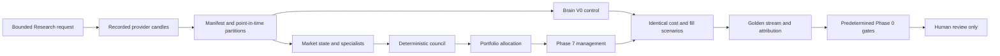

# Phase 8: Scientific Research and Brain Validation

## Outcome

Phase 8 turns Backtesting into an Experiment Lab for full-brain validation. It
adds point-in-time replay, purged walk-forward folds, an untouched holdout,
deterministic stress scenarios, control/candidate attribution, golden streams,
and a human-only promotion report.

This is Research infrastructure. It has no execution authority.

## Components

- `artifacts/api-server/src/lib/intelligence/research/`: pure contracts,
  partitions, manifests, replay, stress, metrics, multiple testing, golden
  validation, reports, bounded persistence, and the asynchronous runner.
- `lib/db/src/schema/research.ts`: tenant-scoped experiment lifecycle and
  append-only `capture.research_replay_events` storage.
- `artifacts/api-server/src/routes/research.ts`: authenticated, section-scoped
  create/list/detail/replay/cancel API.
- `lib/api-spec/openapi.yaml`: authoritative Research API contract; React and
  Zod clients are generated from it.
- `artifacts/tradecore-pro/src/components/research-experiment-lab.tsx`: creation,
  comparison, uncertainty, gates, attribution, warnings, cancellation, and
  timestamped replay UI.

## Data flow



## Scientific controls

- The universe and candidate fingerprint are frozen before replay.
- Features, regimes, evidence cutoffs, and labels are checked against each
  decision timestamp.
- Only validation folds and the untouched holdout are measured. Purge and
  embargo windows are excluded.
- Fold boundaries force-close simulated positions and reset cross-partition
  state.
- The base decision and management stream is replayed twice and fingerprinted.
- Benjamini-Hochberg accounts for all manifest-declared hypotheses.
- The Experiment Lab performs no parameter sweep, preventing selection of a
  post-hoc isolated optimum. Cost/data/fill robustness is assessed by the
  predeclared stress suite.
- The manifest declares conservative spread proxies separately from slippage.
  The shared fill model applies their combined adverse price effect, while
  metrics preserve separate spread and slippage attribution and stress
  multipliers.
- Headline results always accompany costs, drawdown, sample size, uncertainty,
  and gate state.

## API

All routes are authenticated and scoped by the existing `X-Section` contract.

- `POST /api/research/experiments`: accept a bounded asynchronous request.
- `GET /api/research/experiments`: list the current tenant/section.
- `GET /api/research/experiments/{id}`: lifecycle, manifest, and report.
- `GET /api/research/experiments/{id}/events`: ordered replay pagination, up to
  500 events per page.
- `POST /api/research/experiments/{id}/cancel`: cooperative cancellation.

There is deliberately no promotion or execution endpoint.

## Operational behavior

Only one job may prepare or run per tenant and section. A request is refused if
it would exceed 80,000 estimated decision and management events. Persistence refuses more than
100,000 replay events. Inputs are limited to ten symbols and the `1m` timeframe
used by the full-brain feature set. Decisions are sampled on a manifest-hashed
five-minute cadence; fills and management still consume the intervening `1m`
candles so exit behavior is not coarsened.

Provider history is validated by the existing historical-data loaders. The
server does not enable their synthetic-data escape hatch. Insufficient history
or invalid frames produce abstention/failure, never fabricated candles.

Interrupted jobs resume serially at startup. The runner recomputes from the
manifest, verifies any stored prefix, and appends only the reproducible suffix.
A changed data or manifest fingerprint fails the job.

## Authority boundaries

- Research cannot import or call a Live/Demo trading engine, exchange client,
  broker client, order executor, or deployment integration.
- Reusing `execution/fillModel.ts` means pure simulated fills only; it grants no
  external authority.
- Existing deterministic portfolio and Phase 7 loss bounds are preserved.
- AI narratives are disabled in the first implementation. Future narrative
  output may be observational only and cannot change inputs, measurements,
  partitions, labels, gates, or recommendations.
- Any move beyond `ELIGIBLE_FOR_HUMAN_REVIEW` requires a separately approved
  future phase and the frozen Phase 0 promotion policy.

## Validation commands

Run focused validation first:

```powershell
$env:NODE_PATH=(Resolve-Path 'node_modules\.pnpm\@esbuild+win32-x64@0.27.3\node_modules').Path
pnpm --filter @workspace/api-server exec tsx harness/research-validation.test.ts
pnpm --filter @workspace/api-server run typecheck
pnpm --filter @workspace/tradecore-pro run typecheck
pnpm --filter @workspace/api-spec run codegen
```

Database validation requires a disposable PostgreSQL database with the current
schema and capture grants applied:

```powershell
pnpm --filter @workspace/api-server exec tsx harness/schema-security.test.ts
```

The browser suite uses mocked authenticated APIs and covers creation,
comparison, replay, warnings, and failure states:

```powershell
pnpm exec playwright test artifacts/tradecore-pro/e2e/phase8-experiment-lab.spec.ts
```

## Rollback

Rollback is code/schema deployment rollback, not a data reinterpretation. Stop
accepting new Research jobs, allow/cancel the active job, deploy the prior
application, and retain experiment/replay records for audit. The Research
tables are isolated from trading state, so rollback must not modify trades,
engine configuration, risk controls, credentials, or provider configuration.
